|------|-------|-------|--------|--------|--------|
|[ ★ ](index.md) | [Education](education.md) | [Employment](employment.md) | [Research](publications.md) | [Extracurriculars](activities.md) | [Accomplishments](accomplishments.md) | [Skills](skills.md) |

# ACM, the Association for Computing Machinery
 
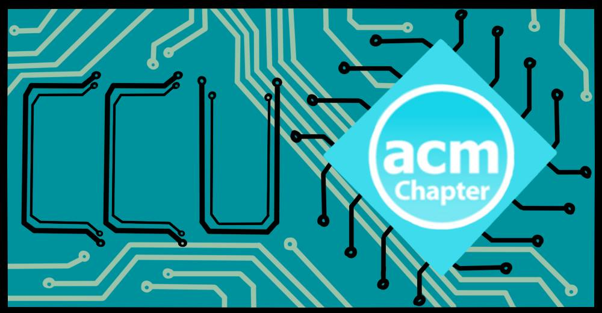

 In this student chapter of the official international scientific and industrial computer society, we hosted various presentations from a variety of speakers, discussed current technology developments, and engaged in hands-on projects. Even though our focus was on giving CS/IS/IT majors real world experience, we also offered events for students of all majors to enjoy. Please look through the photos to see all of our past projects. All of our events were open to all majors, as we encouraged non-technology majors to participate due to the increasing technology dependence in the world.

Click [Here](https://coastal.campuslabs.com/engage/organization/ccuacmstudchapt) for more information.

## Activities

April 2019  
We hosted a [STEM night](https://www.facebook.com/pg/theekklesialaunchpad/photos/?tab=album&album_id=320828341916389) for 7th-12th graders at The Launchpad. It consisted of a Nerf war (featuring a computer-operated Nerf turret we built), LED cube building (that we designed), an escape room (that we wrote), and games and snacks! 

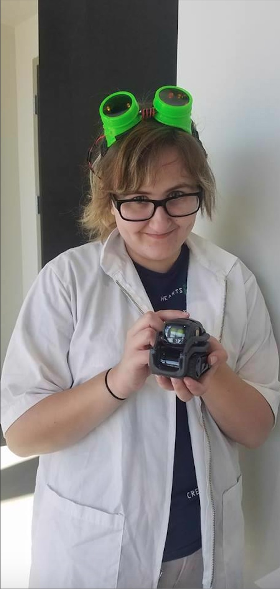
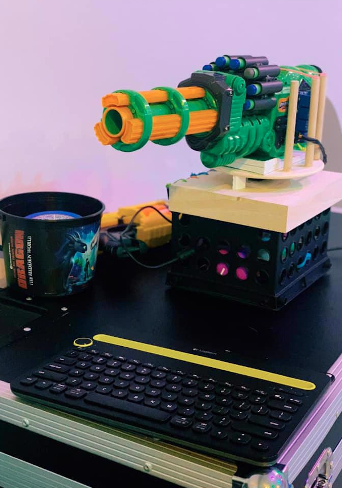
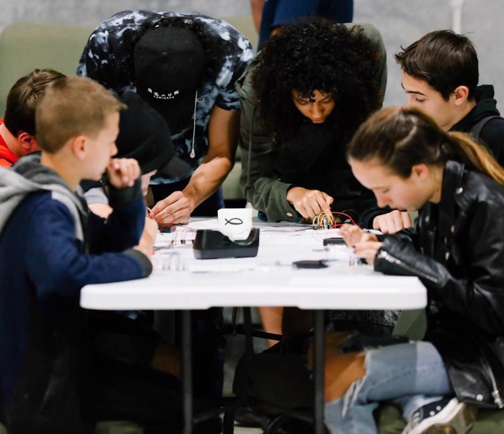

2018-2019 School Year  
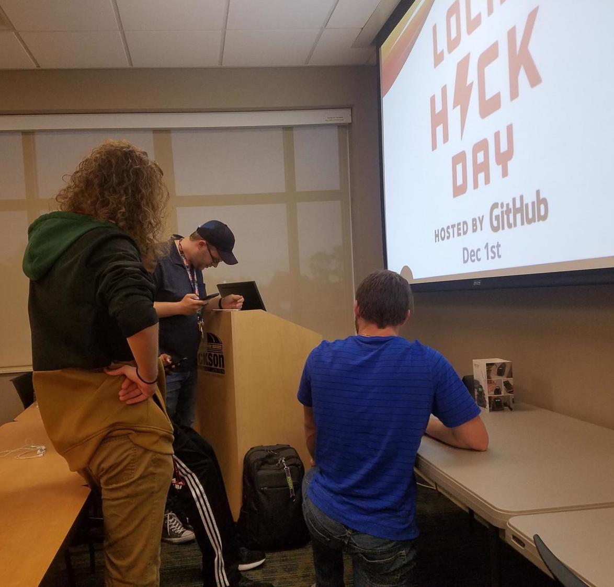
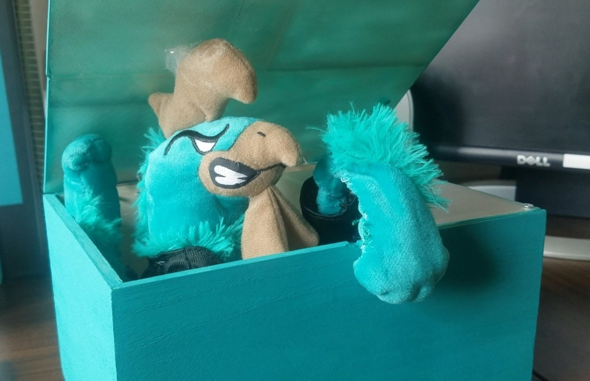
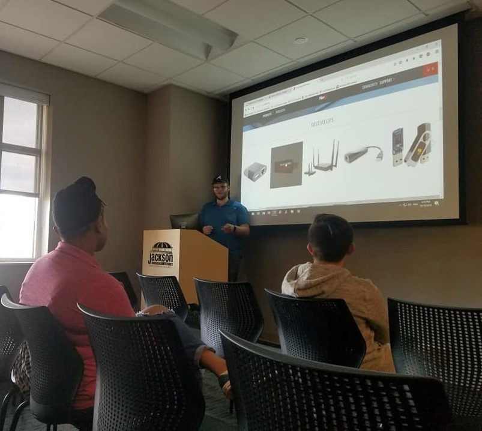

2017-2018 School Year  
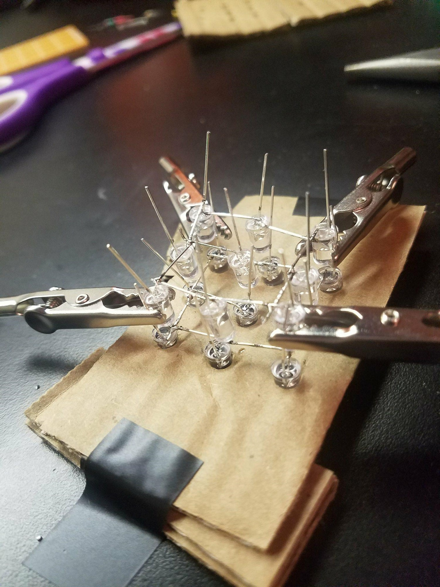
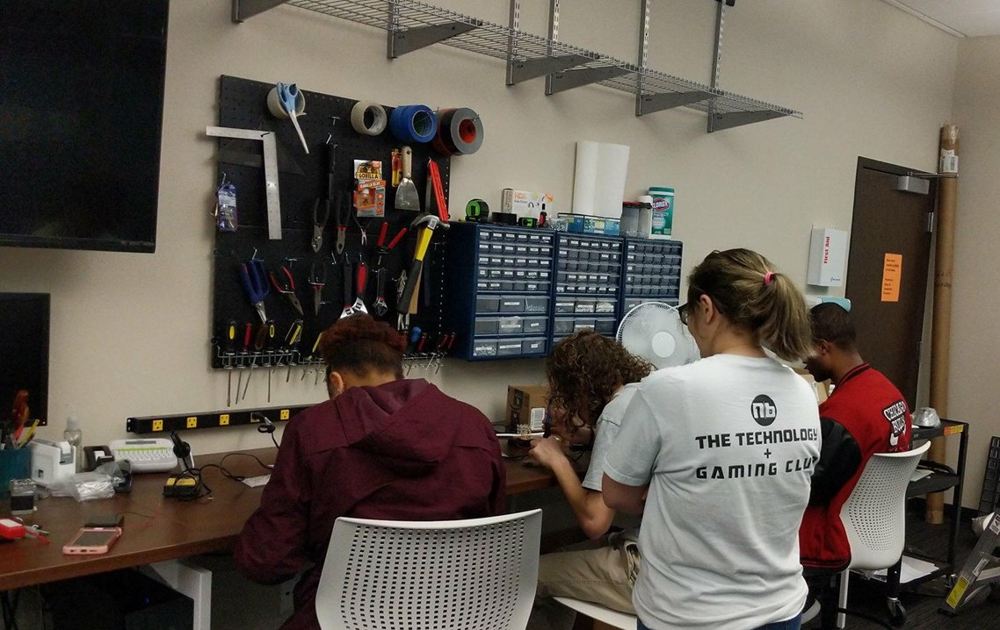
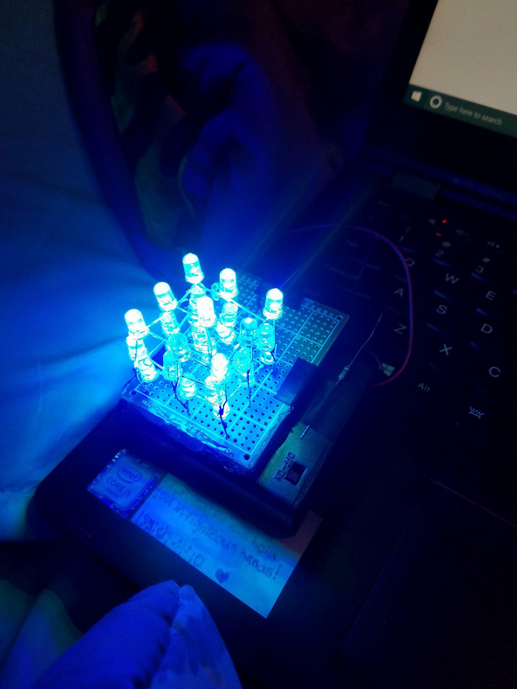
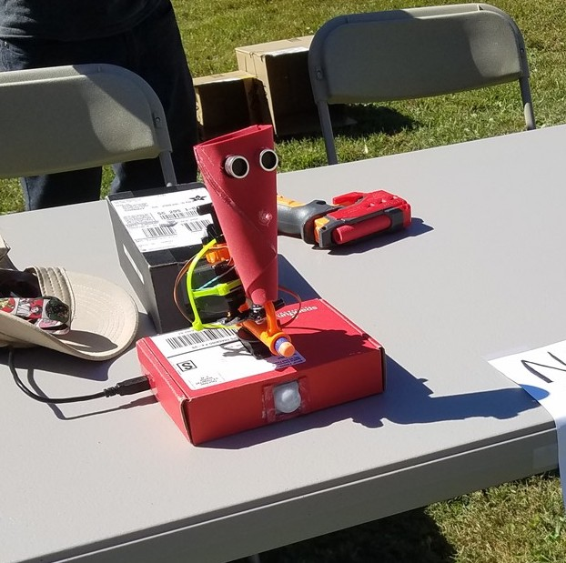
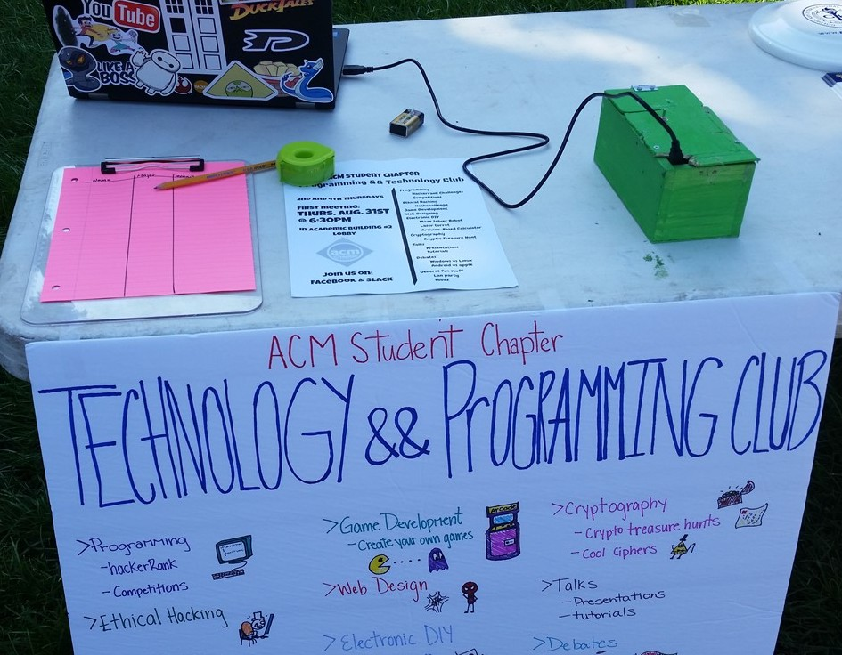
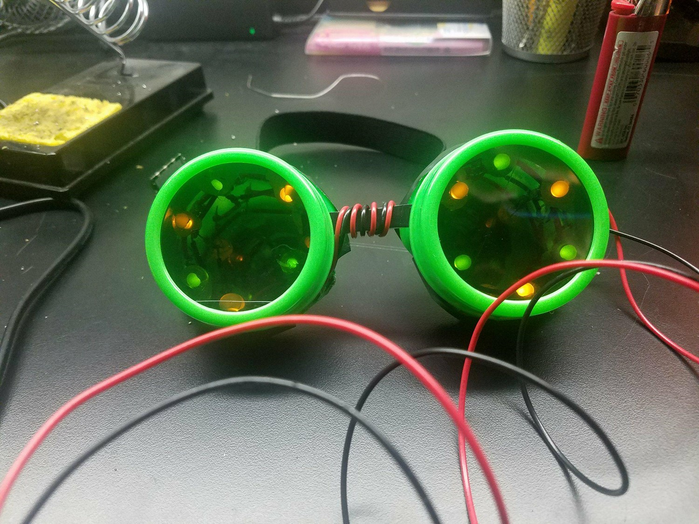

May 2019

Members from our group partcipated in an [escape room](https://www.facebook.com/BackstageEscapeGames/?tn-str=k*F). We escaped with 6 minutes to spare!

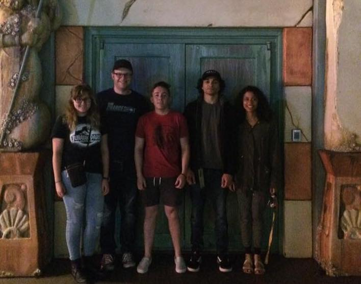

