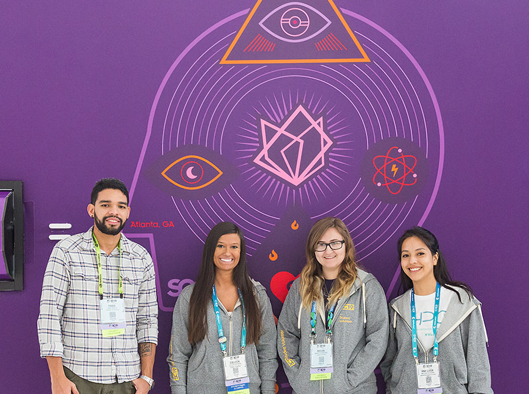

|------|-------|-------|--------|--------|--------|
|[ ★ ](index.md) | [Education](education.md) | [Employment](employment.md) | [Research](publications.md) | [Extracurriculars](activities.md) | [Accomplishments](accomplishments.md) | [Skills](skills.md) |

## (2019 - 2021) While at Clemson University:

(3) [SC 20](https://sc20.supercomputing.org/) (Virtual) Student Volunteer. (November 2020)

(2) [SC 19](https://sc19.supercomputing.org/) Student Volunteer. (November 2019)

 
 
 

(1) Ekklesia Christian Church Website Development Leader - Designed and maintained website. (FA 2018 - Present)  
[http://ekklesiachristianchurch.com/](http://ekklesiachristianchurch.com/)

## (2015 - 2019) While at Coastal Carolina University:
(10) [CCU ACM Student Chapter](acm.html) - Founder, Vice Chair (17-18), Chair (18-19)

(9) Upsilon Pi Epsilon - Vice President (FA 2019)

(8) Ekklesia Christian Church Website Development Leader - Designed and maintain website (FALL 2018 - Present)  http://ekklesiachristianchurch.com/ 

(7) Ekklesia Christian Church Media Team Volunteer- Prepared stage for events (SP 2016 - SP 2019)  
Setup crew volunteer, controlled lyrics display during worship, aided in app and website development.

 

(6) CCU Women in STEM Fellowship - Women in the Sciences Fellowship, Mentor (SP 2018 - FA 2019)

(5) Honors Fellowship - Organized orientation, mentored students, completed research, Fellow (FA 2015 - SP 2019)

(4) Women in Computing - Women in the Sciences Club, Member (FA 2016 - SP 2017)

(3) Numbers & Bytes - Computer Science and Technology Club, Member (FA 2015 - FA 2016)

(2) Astro-Club - Member (FA 2015 - SP 2016)

(1) Honors Program Activities Club - Member (FA 2015 - SP 2016)

### Projects
I completed various projects during this time, including:  

(1) Useless Box  
(2) Motion Sensor Turret  
(3) LED Infinity Goggles  
(4) LED Cube Lamp  
(5) Useless Box 2.0  
(6) Remote Controlled Nerf Turret

## (2011 - 2015) While at Ashley Ridge High School:
(11) South Carolina Young Adult Book Award Readers Club - Member (11-13), Vice-President (13-15)

(10) Mu Alpha Theta (FA 2013 - SP 2015)

(9) National Honor Society (FA 2014 - SP 2015)

(8) Senior Club (SP 2014 - FA 2015)

(7) Tutored students in Animation (FA 2015)

(6) Swampfest - Special Needs Assistant, Booth Operator (April 2012, ‘14, ‘15)

(5) Math is Cool Competition, Volunteer (April 2012, ‘14, ‘15)

(4) Archery Team - Member (FA 2012 - SP 2014)

      State Tournament: Scored 241/300

      Local Tournament: Scored 202/300 

(3) Tutored students in Digital Multimedia (2014)

(2) English Honor Society - English Tutor (2012 - 2013)

(1) Math Team (2011 - 2012)

