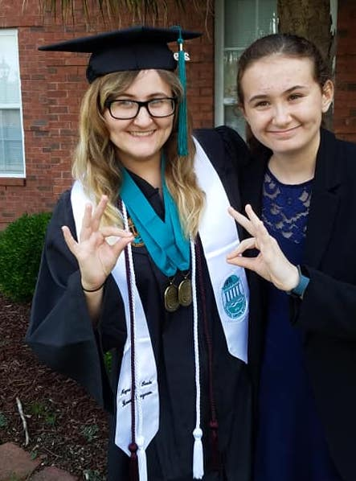

|------|-------|-------|--------|--------|--------|
|[ ★ ](index.md) | [Education](education.md) | [Employment](employment.md) | [Research](publications.md) | [Extracurriculars](activities.md) | [Accomplishments](accomplishments.md) | [Skills](skills.md) |

## Education History

**Clemson University**  
M.S. in Computer Engineering  
Focus in TBD  
4.0 GPA Scale: TBD  
Clemson, SC  
(FA 2019 - SP 2021)  

  

  
  
**Coastal Carolina University**    
B.S. in Computer Science  
Minor in Applied Mathematics
4.0 GPA Scale: 3.950  
Summa Cum Laude, as Part of the Honors Program  
Conway, SC  
(FA 2015 - SP 2019)  

&nbsp;&nbsp;&nbsp;&nbsp;&nbsp;&nbsp;&nbsp;&nbsp;&nbsp;&nbsp;&nbsp;&nbsp;&nbsp;&nbsp;&nbsp;&nbsp;&nbsp;&nbsp;&nbsp;&nbsp;&nbsp;&nbsp;&nbsp;&nbsp;&nbsp;&nbsp;&nbsp;&nbsp;&nbsp;&nbsp;&nbsp;&nbsp;&nbsp;&nbsp;&nbsp;&nbsp;&nbsp;&nbsp;&nbsp;&nbsp;&nbsp;&nbsp;&nbsp;&nbsp;&nbsp;&nbsp;&nbsp;&nbsp;&nbsp;&nbsp;&nbsp;&nbsp;&nbsp;&nbsp;&nbsp;&nbsp;&nbsp;&nbsp;&nbsp;&nbsp;&nbsp;&nbsp;&nbsp;&nbsp;&nbsp;&nbsp;&nbsp;&nbsp;&nbsp;&nbsp;&nbsp;&nbsp;&nbsp;&nbsp;&nbsp;&nbsp;&nbsp;&nbsp;&nbsp;&nbsp;&nbsp;&nbsp;&nbsp;&nbsp;&nbsp;&nbsp;&nbsp;&nbsp;&nbsp;&nbsp;&nbsp;&nbsp;&nbsp;&nbsp;&nbsp;&nbsp;&nbsp;&nbsp;&nbsp;&nbsp;&nbsp;&nbsp;&nbsp;&nbsp;&nbsp;&nbsp;&nbsp;&nbsp;&nbsp;&nbsp;&nbsp;&nbsp;&nbsp;&nbsp;&nbsp;&nbsp;&nbsp;&nbsp;&nbsp;&nbsp;&nbsp;&nbsp;&nbsp;&nbsp;&nbsp;&nbsp;&nbsp;&nbsp;&nbsp;&nbsp;&nbsp;&nbsp;&nbsp;&nbsp;&nbsp;&nbsp;&nbsp;&nbsp;&nbsp;&nbsp;&nbsp;&nbsp;&nbsp;&nbsp;&nbsp;&nbsp;&nbsp;&nbsp;&nbsp;&nbsp;&nbsp;&nbsp;

**Ashley Ridge High School**  
4.0 GPA Scale: 3.876  
SC UGP GPA Scale: 4.667  
Class Rank: 11/450  
ACT Scores: E: 30, M: 25, R: 27, S: 29, Comp: 28  
Summerville, SC  
(FA 2011 - SP 2015)  
