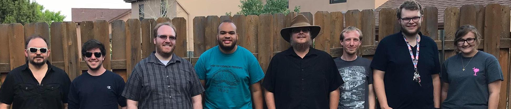

|------|-------|-------|--------|--------|--------|
|[ ★ ](index.md) | [Education](education.md) | [Employment](employment.md) | [Research](publications.md) | [Extracurriculars](activities.md) | [Accomplishments](accomplishments.md) | [Skills](skills.md) |

## Employment History

[RESEARCH ASSISTANT](http://jonccal.people.clemson.edu/research.php#) | Clemson University | Clemson, SC | August 2019 - Current
```markdown
While achieving my MS, I am working on research at Clemson University under Dr. Jon Calhoun 
as my thesis advisor. I have researched various topics under Lossy Compression, including 
power consumption, huffman encoding on GPUs, and data visualization.

For more details, look under the "Research" tab.
```

[RESEARCH ASSISTANT](https://www.coastal.edu/computing/facultystaff/lanl-ccucollaboration/#d.en.140722) | [Los Alamos National Laboratory](https://www.lanl.gov/projects/ultrascale-systems-research-center/staff-interns.php) & Coastal Carolina University | Los Alamos, NM & Conway, SC| Aug. 2017 - Aug. 2019
```markdown
I was hired as a research assistant to work with Dr. William Jones' research with LANL.
This work had a primary focus on data analytics for HPC resilience, exposing me to tools 
including R, Python, ElasticSearch, and Apache Spark.

My first year of research used capabilities from ElasticSearch and our own methods to develop
a means to match source code lines with messages written to various HPC system logs. This 
research led me to an invitation for a summer internship at LANL in 2018, which resulted in 
a scholarly publication at the 2018 IEEE International Symposium on Software Reliability 
Engineering Workshops (ISSREW). 

The second year of research dealt with using Apache Spark and Python to ingest and filter 
events from multiple different logs to assist in the understanding of a HPC machine's health. 
This research resulted in another summer internship at LANL and a presentation at 
Supercomputing 2019.

For more details, look under the "Research" tab.
```

 <div style="text-align:center"></div>


MALWARE ANALYST | [Wetstone Technologies](https://www.wetstonetech.com/) | Myrtle Beach, SC | Aug. 2016 - July 2017
```markdown
Researched various types of malware and obtained samples or MD5 hashes to include in a repository.  
Located potentially malicious applications, examined their contents, then added samples to a database.  
Automated processes of taking apart malware to prevent duplicates of malware in the repository.  
Disassembled various tools such as keyloggers, toolkits, and spyware to determine their uniqueness.  
```
HONORS FELLOW | CCU Dept. of Honors | Conway, SC | Aug. 2015 - May 2019
```markdown
Organized orientation activities, attended mentoring classes, completed research.  
Assist students in problem solving and explained concepts to students.  
```
COMPUTER SCIENCE TUTOR | [CCU Dept. of Science](https://www.coastal.edu/computing/) | Conway, SC | Aug. 2016 - May 2017
```markdown
Assisted students with gaining a better understanding of various Computer Science related material.
```
COMPUTER SCIENCE TEACHING ASSISTANT | [CCU Dept. of Science](https://www.coastal.edu/computing/) | Conway, SC | 2017
```markdown
Assisted students with coding in Java.
Graded assignments dealing with Java programs.
```