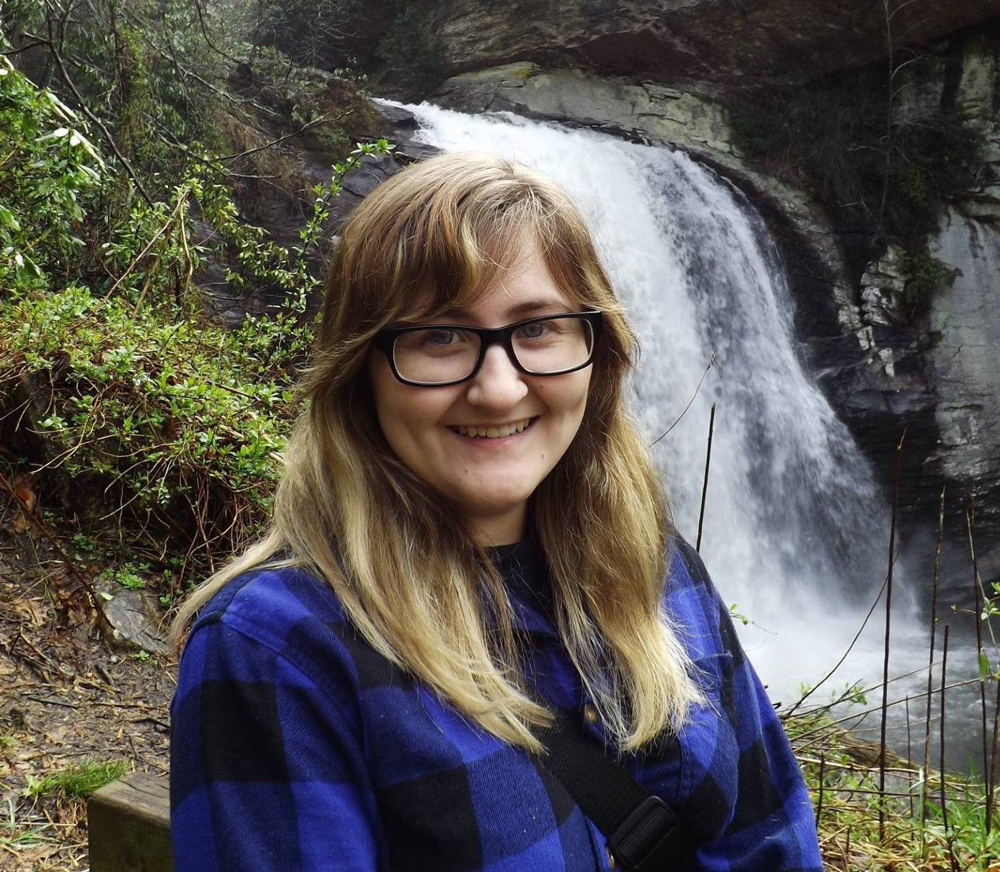

|------|-------|-------|--------|--------|--------|
|[ ★ ](index.md) | [Education](education.md) | [Employment](employment.md) | [Research](publications.md) | [Extracurriculars](activities.md) | [Accomplishments](accomplishments.md) | [Skills](skills.md) |

# Greetings!

&nbsp;&nbsp;Currently, I am an Research Assistant for [Jon C. Calhoun](http://jonccal.people.clemson.edu/) of 
&nbsp;&nbsp;the Holcombe Dept. of Electrical and Computer 
&nbsp;&nbsp;Engineering at Clemson University. I obtained a Bachelor’s 
&nbsp;&nbsp;Degree in Computer Science from [Coastal Carolina 
&nbsp;&nbsp;University](https://www.coastal.edu/computing/), doing research with [William M. Jones](https://www.coastal.edu/academics/facultyprofiles/science/computingsciences/williammjonesjr/) and [USRC 
&nbsp;&nbsp;and Los Alamos National Laboratory](https://www.coastal.edu/computing/facultystaff/lanl-ccucollaboration/). 

&nbsp;&nbsp;My research interests lie in High-Performance Computing 
&nbsp;&nbsp;(HPC) and Big Data Reduction, specifically with data 
&nbsp;&nbsp;sampling and lossy compression. Take a look at my other 
&nbsp;&nbsp;interests and past research projects to learn more!

&nbsp;&nbsp;&nbsp;&nbsp;&nbsp;&nbsp;&nbsp;&nbsp;&nbsp;&nbsp;&nbsp;&nbsp;&nbsp;&nbsp;&nbsp;&nbsp;&nbsp;&nbsp;&nbsp;&nbsp;&nbsp;&nbsp;&nbsp;&nbsp;&nbsp;&nbsp;&nbsp;&nbsp;&nbsp;&nbsp;&nbsp;&nbsp;&nbsp;&nbsp;&nbsp;&nbsp;&nbsp;&nbsp;&nbsp;&nbsp;&nbsp;&nbsp;&nbsp;&nbsp;&nbsp;&nbsp;&nbsp;&nbsp;&nbsp;&nbsp;&nbsp;&nbsp;&nbsp;&nbsp;&nbsp;&nbsp;&nbsp;&nbsp;&nbsp;&nbsp;&nbsp;&nbsp;&nbsp;&nbsp;&nbsp;&nbsp;&nbsp;&nbsp;&nbsp;&nbsp;&nbsp;&nbsp;&nbsp;&nbsp;&nbsp;&nbsp;&nbsp;&nbsp;&nbsp;&nbsp;&nbsp;&nbsp;&nbsp;&nbsp;&nbsp;&nbsp;&nbsp;&nbsp;&nbsp;&nbsp;&nbsp;&nbsp;&nbsp;&nbsp;&nbsp;&nbsp;&nbsp;&nbsp;&nbsp;&nbsp;&nbsp;&nbsp;&nbsp;&nbsp;&nbsp;&nbsp;&nbsp;&nbsp;&nbsp;&nbsp;&nbsp;&nbsp;&nbsp;&nbsp;&nbsp;&nbsp;&nbsp;&nbsp;&nbsp;&nbsp;&nbsp;&nbsp;&nbsp;&nbsp;&nbsp;&nbsp;&nbsp;&nbsp;&nbsp;&nbsp;&nbsp;&nbsp;&nbsp;&nbsp;&nbsp;&nbsp;&nbsp;&nbsp;

## Megan at a Glance

* **Research Assistant** - Clemson University - Clemson, SC - August 2019-Present
  - Advisor: [Jon C. Calhoun](http://jonccal.people.clemson.edu/)  
  - Explored energy profiles of various lossy compressors to analyze workflow, using RAPL and PAPI.
  - Researched how to efficiently parallelize (via CUDA) the generation of frequency distributions to alleviate the Huffman Encoding bottleneck in the GPU implementation of the lossy compressor SZ.
  - Investigated the development and implementation of in situ algorithms that combine spatial and temporal sampling to enable massive data reductions without losing important information.

* **PhD Graduate Student** (Currently Enrolled) - Clemson University - Holcombe Department of Electrical and Computer Engineering
  - PhD of Science, Computer Engineering (ABET Accredited)
  - Cumulative GPA: 3.99

* **MS Graduate Student** (2021) - Clemson University - Holcombe Department of Electrical and Computer Engineering
  - Master of Science, Computer Engineering (ABET Accredited)
  - Focus: Computer Systems Architecture  
  - Thesis Topic in Data Reduction Techniques  
  - Cumulative GPA: 3.99

* B.S. Computer Science (Honors) (2019) - Coastal Carolina University - Department of Computing Sciences
  - Cumulative GPA: 3.950
* Minor in Applied Mathematics (2019) - Coastal Carolina University - Department of Mathematics and Statistics

* Research Interests: High-Performance Computing, Data Reduction, Data Sampling, Lossy Compression

## Contact information
* mlhickm@clemson.edu
* <a href="https://mhickmanf.github.io/documents/resume.pdf" target="_blank">Resume</a>
* <a href="https://mhickmanf.github.io/documents/cv.pdf" target="_blank">CV</a>  
* [linkedIn](https://www.linkedin.com/in/megan-hickman-fulp-3174a3125/)

## Index

[Educational History](education.md)  
[Employment History](employment.md)  
[Publications, Presentations, and Posters](publications.md)   
[Extracurricular Activities](activities.md)   
[Academic Accomplishments](accomplishments.md)   
[Skills](skills.md)   
[ACM Student Chapter](acm.md)    
