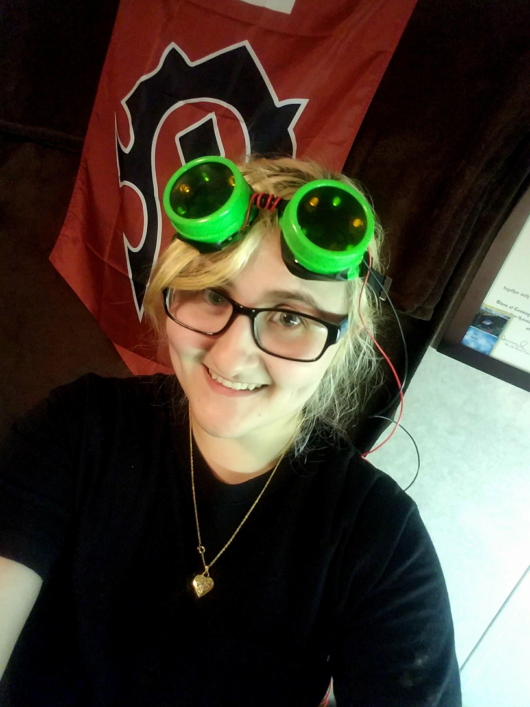

|------:|-------|--------|--------|--------|
|[- Education](education.md) | [- Employment](employment.md) | [- Research](publications.md) | [- Extracurrilculars](activities.md) | [- Accomplishments](accomplishments.md) | [- Skills](skills.md) |

# Greetings!

&nbsp;&nbsp;&nbsp;&nbsp;

&nbsp;&nbsp;Currently I am an Research Assistant for [Jon Calhoun](http://jonccal.people.clemson.edu/) of Electrical   
&nbsp;&nbsp;and Computer Engineering at Clemson University. I obtained a   
&nbsp;&nbsp;Bachlor's Degree in Computer Science from Coastal Carolina   
&nbsp;&nbsp;University, doing research for [William M. Jones](https://www.coastal.edu/academics/  facultyprofiles/science/computingsciences/williammjonesjr/) and [USRC and Los   
&nbsp;&nbsp;Alamos National Laboratory](https://www.lanl.gov/projects/ultrascale-systems-research-center/staff-interns.php). At Clemson, my research will be   
&nbsp;&nbsp;involved in Data Compression. Take a look at my other interests and   
&nbsp;&nbsp;past research projects to learn more!

&nbsp;&nbsp;&nbsp;&nbsp;&nbsp;&nbsp;&nbsp;&nbsp;&nbsp;&nbsp;&nbsp;&nbsp;&nbsp;&nbsp;&nbsp;&nbsp;&nbsp;&nbsp;&nbsp;&nbsp;&nbsp;&nbsp;&nbsp;&nbsp;&nbsp;&nbsp;&nbsp;&nbsp;&nbsp;&nbsp;&nbsp;&nbsp;&nbsp;&nbsp;&nbsp;&nbsp;&nbsp;&nbsp;&nbsp;&nbsp;&nbsp;&nbsp;&nbsp;&nbsp;&nbsp;&nbsp;&nbsp;&nbsp;&nbsp;&nbsp;&nbsp;&nbsp;&nbsp;&nbsp;&nbsp;&nbsp;&nbsp;&nbsp;&nbsp;&nbsp;&nbsp;&nbsp;&nbsp;&nbsp;&nbsp;&nbsp;&nbsp;&nbsp;&nbsp;&nbsp;&nbsp;&nbsp;&nbsp;&nbsp;&nbsp;&nbsp;&nbsp;&nbsp;&nbsp;&nbsp;&nbsp;&nbsp;&nbsp;&nbsp;&nbsp;&nbsp;&nbsp;&nbsp;&nbsp;&nbsp;&nbsp;&nbsp;&nbsp;&nbsp;&nbsp;&nbsp;&nbsp;&nbsp;&nbsp;&nbsp;&nbsp;&nbsp;&nbsp;&nbsp;&nbsp;&nbsp;&nbsp;&nbsp;&nbsp;&nbsp;&nbsp;&nbsp;&nbsp;&nbsp;&nbsp;&nbsp;&nbsp;&nbsp;&nbsp;&nbsp;&nbsp;&nbsp;&nbsp;&nbsp;&nbsp;&nbsp;&nbsp;&nbsp;&nbsp;&nbsp;&nbsp;&nbsp;&nbsp;&nbsp;&nbsp;&nbsp;&nbsp;&nbsp;

## Megan at a Glance

* Research Assistant - Clemson University Holcombe Department of Electrical and Computer Engineering  
  - Adviser: Jon Calhoun  

* Master's Student (Currently Enrolled) - Clemson University Holcombe Department of Electrical and Computer Engineering
  - Focus: TBD  

* B.S. Computer Science (2019) - Coastal Carolina University  
* Minor in Applied Mathematics (2019) - Coastal Carolina University  

## Contact information
* mlhickm@clemson.edu
* [Resume](<a href="mhickmanf.github.io/resume_website/resume.pdf" target="_blank">PDF.</a>)
* [linkedIn](https://www.linkedin.com/in/megan-hickman-fulp-3174a3125/)

## Overview

[Educational History](education.md)  
[Employment History](employment.md)  
[Publications, Presentations, and Posters](publications.md)   
[Extracurrilcular Activities](activities.md)   
[Academic Accomplishments](accomplishments.md)   
[Skills](skills.md)   
