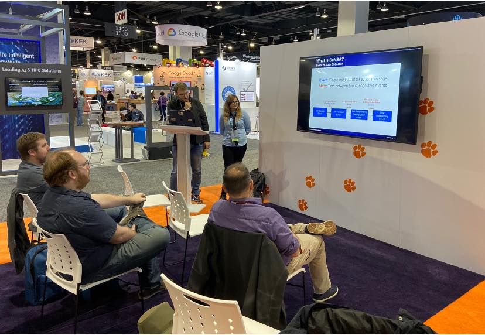
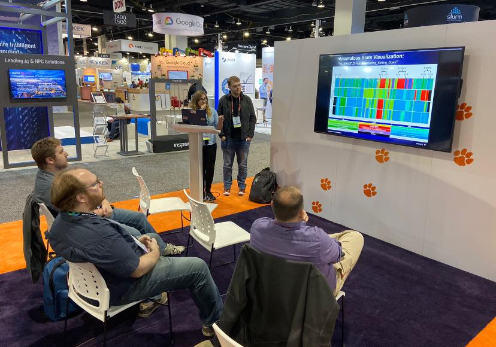

|------|-------|-------|--------|--------|--------|
|[ ★ ](index.md) | [Education](education.md) | [Employment](employment.md) | [Research](publications.md) | [Extracurriculars](activities.md) | [Accomplishments](accomplishments.md) | [Skills](skills.md) |

## RESEARCH

(Fall 2020 - Present) **Data Sampling**

```markdown
Over the summer, I was invited to be a part of the virtual 2020 Data Science at Scale Summer School as part of the Los Alamos Summer Fellowship. I was recruited to research In situ Data Analysis and Visualization Workflows. As high-performance computing grows into the exascale range, post-hoc analysis alone is becoming less viable. To overcome the storage and bandwidth bottlenecks, in situ data analysis and visualization selects, analyzes, reduces and extracts data from a scientific simulation as the results are still being generated, then the downsized results can be examined post-hoc. Current state-of-the-art sampling methods save data points if their region is deemed spatially or temporally important. Often, scientific datasets show strong correlation across time-steps, thus causing neighboring time-steps to be very similar. We aimed to exploit this correlation to devise a more useful sampling method - one that combines spatial and temporal sampling to choose higher quality samples from large scale data that will result in higher qualities than existing methods, post-reconstruction. This reseach continued past the internship, where it resulted in a scholarly publication at the 2020 IEEE International Workshop on Big Data Reduction (See 'Papers (3)') and several presentations (See 'Presentations').
```

(Spring 2020) **CuSZ**

```markdown
In a collaboration with the creators of the GPU implementation of the state-of-the-art lossy compressor SZ (CuSZ), we were able to optimize the compressors performance by utilizing CUDA and GPU memory bandwidth. I was tasked with researching how to develop an efficient customized Huffman coding method for the SZ compressor to work with GPUs, which was previously a significant bottleneck in the implementation. This work was featured in a scholarly publication at the 2020 ACM International Conference on Parallel Architectures and Compilation Techniques (PACT'20) (See 'Papers (2)').
```

(Fall 2019) **Energy Profiles of Lossy Compressors**

```markdown
* Explored energy profiles of various lossy compressors to analyze workflow, using resources like RAPL (see: http://web.eece.maine.edu/~vweaver/projects/rapl/) and PAPI.
```

(2018 - 2019) **Data Analytics for HPC Resilience: Using [SaNSA](https://ieeexplore.ieee.org/abstract/document/8564489)**
```markdown
SaNSA (Supercomputer and Node State Architecture) is a tool designed to help users visualize HPC states by ingesting system logs. After ingesting system and scheduler events from a machine, time-in-state and events-per-state are calculated. At the time of research, there were 26 different states (i.e. job running, idle, kernel panic, maintence, etc.) that could be captured from all nodes on a given HPC, resulting in the potential for extremely large datasets. Over my second summer at LANL, my research partner (Dakota Fulp) and I improved the pipeline by utilizing Apache Spark and Elasticsearch to perform calculations at a lower overhead. It was my specific task to implement a method that would calculate and analyze the percentage of time spent in each state per node such that we could pick out specific nodes that had spent an anomalous amount of time in a certain state. Once the anomalous nodes have been identified, I created a plot that would allow a system administrator to visualize a node's states over time, making it easier to find the cause of the anomaly and deterrmine correlated failures.
```
(2017 - 2018) **Data Analytics for HPC Resilience**

```markdown
I was hired as a research assistant in August 2017 to work with Dr. Jones’ research with LANL, and was invited for a summer internship at LANL in 2018. During this internship, our goal was to find the file in source code that is most likely the origin of a system log (syslog) message. By knowing what piece of software created a warning, bug, or error notification in the syslog can assist in diagnosing and debugging problems and help identify root causes. I started by ingesting kernel source code into the open source search engine ElasticSearch (ES), then searched for a sanitized syslog message. ES would then produce the top potential matches with a score showing how relevant it thinks the file is to the syslog line. Based on our results, we predicted with 95% confidence that our method can detect the correct origin file between 88.8% and 96.1% of the time. This work resulted in a scholarly publication at the 2018 IEEE International Symposium on Software Reliability Engineering Workshops (ISSREW) (See 'Papers (1)').
```

## PUBLICATIONS

### PAPERS

(3) **Hickman Fulp**, M., Biswas, A., and Calhoun, J. Combining Spatial and Temporal Properties for Improvements in Data Reduction. In Proceedings of the International Workshop on Big Data Reduction, Accepted, IEEE, 2020.

(2) Tian, Jiannan, Sheng Di, Kai Zhao, Cody Rivera, **Megan Hickman Fulp**, Robert Underwood, Sian Jin et al. "Cusz: An efficient gpu-based error-bounded lossy compression framework for scientific data." In Proceedings of the ACM International Conference on Parallel Architectures and Compilation Techniques, pp. 3-15. 2020. 
[https://dl.acm.org/doi/abs/10.1145/3410463.3414624](https://dl.acm.org/doi/abs/10.1145/3410463.3414624)

(1) **Hickman, Megan**, Dakota Fulp, Elisabeth Baseman, Sean Blanchard, Hugh Greenberg, William Jones, and Nathan DeBardeleben. "Enhancing HPC system log analysis by identifying message origin in source code." In 2018 IEEE International Symposium on Software Reliability Engineering Workshops (ISSREW), pp. 100-105. IEEE, 2018.
[https://ieeexplore.ieee.org/document/8539171](https://ieeexplore.ieee.org/document/8539171)

### POSTERS

(3) Megan Hickman Fulp, Nathan DeBardeleben, William M. Jones. “HPC State Anomaly Detection and Visualization with SaNSA.” Poster presented at: [USRC Summer Research Symposium](https://usrc.lanl.gov/student-symposiums.php). July 31, 2019; Los Alamos, NM.

(2) Megan Hickman Fulp, Nathan DeBardeleben, William M. Jones. “HPC State Anomaly Detection and Visualization with SaNSA.” Poster presented at: [LANL HPC Showcase](https://www.lanl.gov/org/ddste/aldsc/hpc/recruiting/mini-showcase.php). August 1, 2019; Los Alamos, NM.

(1) Megan Hickman, Nathan DeBardeleben, William M. Jones. “Enhancing HPC System Log Analysis by Identifying Message Origin in Source Code.” Poster presented at: USRC Summer Research Symposium. 2018 Aug 6; Los Alamos, NM.


### PRESENTATIONS

(18) Megan Hickman Fulp. “Utilizing Temporal Similarities for Improved Data Reduction”, [International Workshop on Big Data Reduction](https://iwbdr.github.io/iwbdr20/), Virtual. December 2020. 
Mentors: Ayan Biswas; Jon Calhoun.

(17) Megan Hickman Fulp. “Utilizing Temporal Similarities for Improved Data Reduction”, [DRBSD-6](https://web.njit.edu/~qliu/drbsd6.html), Atlanta, GA - Virtual. November 2020. 
Mentors: Ayan Biswas; Jon Calhoun.

(16) Megan Hickman Fulp. “Utilizing Temporal Similarities for Improved Data Reduction”, Los Alamos National Laboratory [Student Symposium] 2020 (https://www.lanl.gov/careers/career-options/student-internships/symposium/index.php), Los Alamos, NM - Virtual. August 2020. 
Mentors: Ayan Biswas; Jon Calhoun.

(15) Megan Hickman Fulp and Dakota Fulp. “Parallel Integration and Other Applications of SaNSA in HPC State Analysis”, SC ‘19, Denver, CO. November 2019. Mentors: Nathan DeBardeleben; William M. Jones.

 
 


(14) Megan Hickman Fulp and Dakota Fulp. “Improving SaNSA: Spark Integration and Anomaly Detection in HPC State Analysis”,  USRC Summer Research Symposium, Los Alamos, NM. July 2019. Mentors: Nathan DeBardeleben; William M. Jones.

(13) “Resume Workshop”, CCU ACM Student Chapter Meeting, CS Department, Coastal Carolina University, February 21, 2019. Discussed: How to make your resume look more professional.

(12) “How to 3D Print”, CCU ACM Student Chapter Meeting, CS Department, Coastal Carolina University, February 14, 2019. Discussed: How to make a 3D model in Tinkercad online software and how 3D printers work.

(11) “Online Privacy”, CCU ACM Student Chapter Meeting, CS Department, Coastal Carolina University, February 7, 2019. Discussed: How to protect your information online. 

(10) “WalkerBot”, CCU ACM Student Chapter Meeting, CS Department, Coastal Carolina University, April 10, 2018. Discussed: How robots can move, including a homemade robot that can “walk” on legs, and Vector, a commercial home robot, who uses treads to move.

(9) “How to use Slack”, CCU ACM Student Chapter Meeting, CS Department, Coastal Carolina University, September 6, 2018.

(8) “Useless Box - Upgraded”, CCU ACM Student Chapter Meeting, CS Department, Coastal Carolina University, August 30, 2018. Discussed: How to construct and code a useless box, upgraded since the first presentation.

(7) “LED Cubes”, CCU ACM Student Chapter Meeting, CS Department, Coastal Carolina University, April 10, 2018. Tutorial: How to make an LED cube lamp, including topics in soldering and resistors.

(6) “LED Goggles”, CCU ACM Student Chapter Meeting, CS Department, Coastal Carolina University, March 20, 2018. Discussed: How to make a pair of “infinity goggles” using LEDs.

(5) “Supercomputing”, CCU ACM Student Chapter Meeting, CS Department, Coastal Carolina University, January 23, 2018. Discussed: Internship at Los Alamos National Laboratory and topics learned at SC 17 conference.

(4) “Making a Turret”, CCU ACM Student Chapter Meeting, CS Department, Coastal Carolina University, October 12, 2017. Discussed: “Jerry,” a motion tracking robot built with PIR and PING sensors.

(3) “Motion Sensors”, CCU ACM Student Chapter Meeting, CS Department, Coastal Carolina University, September 28, 2017. Discussed: The differences between types of motion sensors and how they work.

(2) “How to Solder”, CCU ACM Student Chapter Meeting, CS Department, Coastal Carolina University, September 14, 2017.

(1) “Useless Box Tutorial”, CCU ACM Student Chapter Meeting, CS Department, Coastal Carolina University, August 31, 2017.

